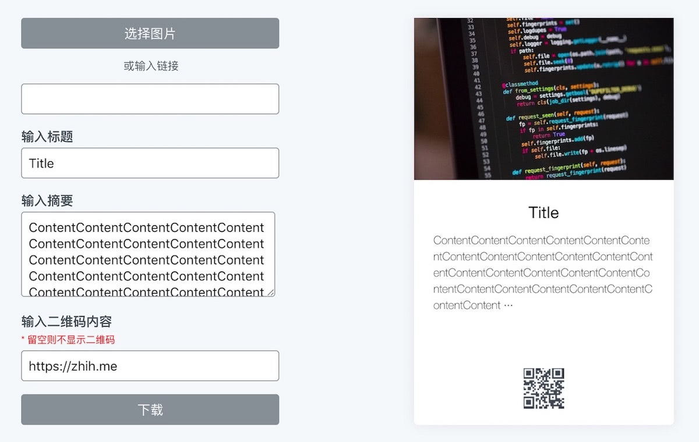

# Share Card

将图片、标题、摘要快速整合成信息卡片，添加链接自动生成二维码，不需要调用后台，全前端方案更轻更快

https://zhih.me/sharecard/



## 实现方法

### 从 URL 获取图片

```javascript
const getImg = imgURL => {
    fetch(imgURL)
        .then(response => response.blob())
        .then(blob => new Promise((resolve, reject) => {
            const reader = new FileReader()
            reader.onloadend = () => resolve(reader.result)
            reader.onerror = reject
            reader.readAsDataURL(blob)
        }))
        .then(dataUrl => {
            document.getElementById('cover').style.backgroundImage = 'url(' + dataUrl + ')'
        })
        .then(() => makeImg())
}
```
### 图片上传

```javascript
const uploadImg = e => {
    var img = e.files[0]
    var reader = new FileReader()
    reader.readAsDataURL(img)
    reader.onloadend = function() {
        document.getElementById('cover').style.backgroundImage = 'url(' + reader.result + ')'
        makeImg()
    }
}
```
### 生成二维码

使用 [qrcode.js](https://davidshimjs.github.io/qrcodejs/) 生成二维码


```javascript
const getQRcode = QRcode => {
    document.getElementById('qrcode').innerHTML = ''

    if (!QRcode) {
        document.getElementById('card-qrcode').style.display = 'none'
        makeImg()
        return
    }

    document.getElementById('card-qrcode').style.display = 'block'
    var qrcode = new QRCode(document.getElementById('qrcode'), {
        width: 50,
        height: 50,
        colorDark: '#3d4752',
        colorLight: '#ffffff',
        correctLevel: QRCode.CorrectLevel.L
    })

    qrcode.makeCode(QRcode)
    makeImg()
}
```
### 生成图片

使用 [html2canvas.js](https://github.com/niklasvh/html2canvas) 生成图片

```javascript
const makeImg = () => {
    html2canvas(document.querySelector('#card'), {
            allowTaint: true,
            taintTest: true,
            useCORS: true,
            scale: 3
        })
        .then(canvas => {
            document.querySelector('.down').setAttribute('href', canvas.toDataURL())
        })
}
```
## 已知问题

1. 由于使用图片转 `base64`，所以图像不是很清晰
2. 图片大小过大时，可能会无法生成图片